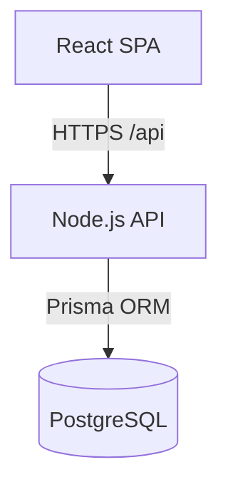
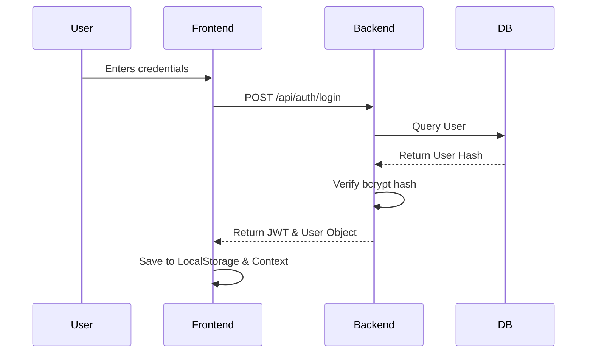

# System Architecture

## Overview
WaypointFlow utilizes a modern web stack, featuring a React 19 single-page application communicating over a REST API powered by Express and Node.js. This backend is backed by a robust PostgreSQL database managed via Prisma ORM.

## Component Interactions
- **Frontend (Vite/React):** Client-side routing with role-based boundaries. Connects to `/api` for all data.
- **Backend (Express):** Exposes secured endpoints utilizing JWT authentication. Routes are split by domain logic (`/orders`, `/planning`, `/driver`).
- **Database (Postgres):** Centralized state, serving as the system's single source of truth.

## System Architecture Diagram

## Authentication Flow
Users log in by providing an email and password.

## Offline Synchronization (Degradation Flow)
Drivers frequently operate in poor network conditions. The application degrades gracefully:
1. When `window.navigator.onLine` evaluates to false, the AppContext toggles `isOffline = true`.
2. Network mutating actions (e.g., Deliveries) are intercepted and pushed to a persistent `localStorage` sync queue.
3. Upon reconnection (`online` event), the sync queue is flushed and processed sequentially by the Express API.

## Planning Engine
The Dispatcher UI relies on the backend Planning controller to fetch constrained vehicles and unassigned orders. The system cross-references vehicle limitations (e.g., Temperature, Weight, Dock constraints) with the order's requirements to assist dispatchers in assigning valid runs.

## Deployment Architecture
For local reproduction and production environments, the stack is orchestrated via Docker Compose:
- **Nginx (Web):** Reverse proxies `/api` to the internal API container and serves static Vite assets.
- **Node.js (API):** Evaluates business logic securely.
- **Postgres (DB):** Stores data with persistence mapped via volume mounts.
