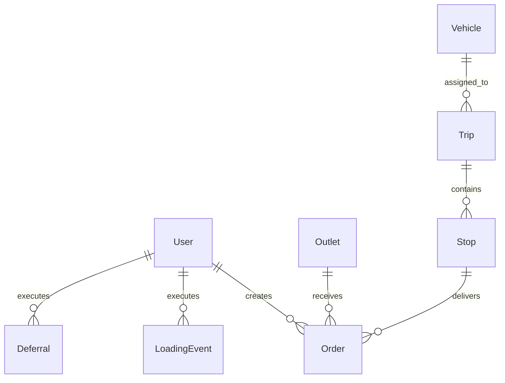

# Data Model

## Entity Relationship Diagram

## Tables & Entities

### 1. User
Manages authentication and role-based access.
- **Roles:** `DISPATCHER`, `LOADER`, `DRIVER`, `STORE_MANAGER`
- **Fields:** Email, bcrypt PasswordHash, Depot.

### 2. Outlet
Destination stores that receive orders.
- **Fields:** District, Address.
- **Constraints:** `parkingConstraint` (e.g., `VAN_ONLY`), `dockType`.

### 3. Vehicle
Fleet information detailing vehicle capabilities.
- **Fields:** Registration, Make/Model.
- **Constraints:** `type` (TRUCK/VAN), `temperature` (REEFER/AMBIENT), `maxWeight`, `maxVolume`.

### 4. Order
Requested goods from outlets.
- **Fields:** Required temperature, total weight, total volume.
- **Statuses:** `NEW`, `PLANNED`, `LOADING`, `IN_TRANSIT`, `DELIVERED`, `DEFERRED`.

### 5. Trip
Assigned runs for vehicles created by the Dispatcher.
- **Fields:** Date, Status (`PLANNED`, `RELEASED`, `COMPLETED`).
- **Relationships:** Links a single Vehicle to multiple Stops.

### 6. Stop
Sequential points on a trip referencing specific orders.
- **Fields:** Sequence index, Status (`PENDING`, `ARRIVED`, `COMPLETED`, `ISSUE`).

## Important Indexes & Relationships
- **Orders** are tied directly to an **Outlet** and a creating **Store Manager (User)**.
- **Trips** act as the central routing entity, aggregating multiple **Stops**. Each **Stop** fulfills exactly one **Order**.

## Lifecycle Overviews

### Order Lifecycle
`NEW` (Store requests) → `PLANNED` (Dispatcher assigns) → `LOADING` (Loader prepares) → `IN_TRANSIT` (Driver departs) → `DELIVERED` (Driver confirms).

### Trip Lifecycle
`PLANNED` (Dispatcher creates) → `RELEASED` (Dispatcher finalizes) → `LOADING` (Loader works) → `READY` (Loader finishes) → `IN_TRANSIT` (Driver starts) → `COMPLETED` (Driver finishes all stops).
